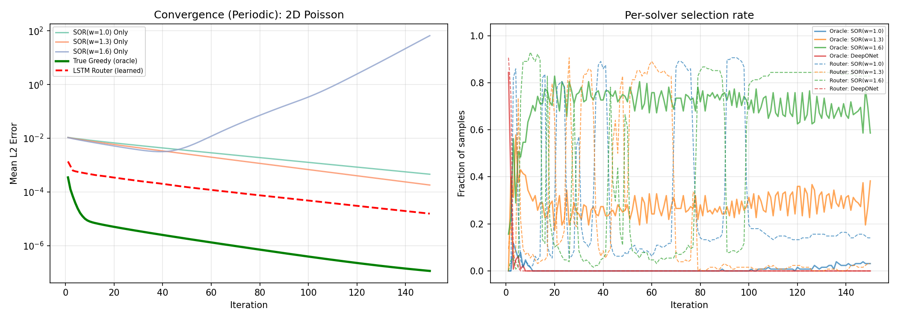
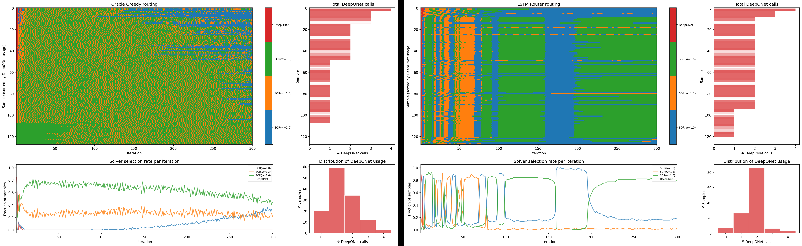
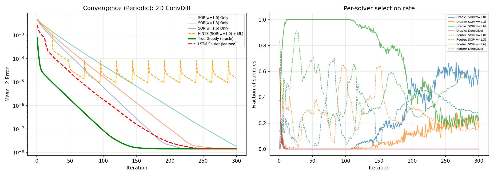
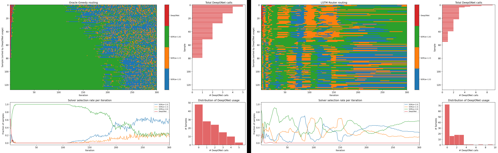

Greedy Multi-Solver Routing for PDE Linear Systems

Adaptive solver selection for incompressible CFD

SemiAnalysis x Fluidstack Hackathon

---

# Motivation: The Poisson Equation Is Everywhere

Ubiquity of Poisson Solves

The Poisson equation $\nabla^2 u = f$ appears as a **core computational kernel** across science and engineering:

- **CFD** — pressure projection in incompressible Navier–Stokes
- **Electrostatics** — electric potential from charge distributions
- **Gravitational physics** — potential fields in astrophysics, geodesy
- **Structural mechanics** — stress analysis, plate bending
- **Heat transfer** — steady-state temperature distributions
- **Image processing** — Poisson blending, inpainting, surface reconstruction

The Neural Operator Dilemma

Neural operators can approximate PDE solutions **orders of magnitude faster** than classical solvers.

But they offer **no convergence guarantees** — predictions may look plausible while being quantitatively wrong.

**Our approach:** Route between classical iterative methods (with guarantees) and a neural operator (with speed). Use ML when it helps, fall back to classical when it doesn't, and **always converge**.

Accelerating the Poisson solve has **outsized practical impact** — it is the dominant bottleneck in projection-based CFD solvers and appears in virtually every branch of computational physics.

---

# Focus: The Poisson Equation

Our Test Problem

**2D Poisson with periodic boundary conditions**

$$-\nabla^2 u = f \quad \text{on } [0,1]^2$$

- Grid size $N = 31$ ($961$ unknowns)
- Forcing $f$ drawn from hierarchical Gaussian random fields
- Solutions unique up to a constant (mean-zero constraint)

This isolates the core challenge: **can adaptive solver routing accelerate convergence of the Poisson linear system?**

---

# The Routing Loop

<svg viewBox="0 0 780 310" style="position:absolute;inset:0;width:100%;height:100%">
  <defs>
    <marker id="arrowC" markerWidth="8" markerHeight="8" refX="7" refY="4" orient="auto">
      <path d="M0,0 L8,4 L0,8 Z" fill="#22d3ee" opacity="0.4"/>
    </marker>
    <marker id="arrowW" markerWidth="8" markerHeight="8" refX="7" refY="4" orient="auto">
      <path d="M0,0 L8,4 L0,8 Z" fill="#fff" opacity="0.5"/>
    </marker>
    <marker id="arrowG" markerWidth="8" markerHeight="8" refX="7" refY="4" orient="auto">
      <path d="M0,0 L8,4 L0,8 Z" fill="#4ade80" opacity="0.7"/>
    </marker>
  </defs>
  <line x1="118" y1="105" x2="222" y2="105" stroke="#fff" stroke-width="1.5" opacity="0.3" marker-end="url(#arrowW)"/>
  <line x1="348" y1="105" x2="452" y2="105" stroke="#fff" stroke-width="1.5" opacity="0.3" marker-end="url(#arrowW)"/>
  <line x1="578" y1="105" x2="662" y2="105" stroke="#fff" stroke-width="1.5" opacity="0.15" stroke-dasharray="6,4" marker-end="url(#arrowW)"/>
  <path d="M 580,125 Q 620,250 390,265 Q 160,280 100,135" fill="none" stroke="#22d3ee" stroke-width="1.5" opacity="0.25" stroke-dasharray="6,4" marker-end="url(#arrowC)"/>
  <path d="M 390,220 L 390,170" stroke="#4ade80" stroke-width="1.5" opacity="0.5" marker-end="url(#arrowG)"/>
</svg>

  

    
u(t)

    
current solution

  

  
router picks k*

  

    

      

        
action

        
argmink err

      

    

    

      
SOR(1.0)

    

    

      
SOR(1.3)

    

    

      
SOR(1.6)

    

    

      
FNO ✦

    

  

  

    
u(t+1)

    
updated solution

  

···

  

    
u*

    
converged

  

  

    
Unrolled training

    
FNO sees real in-loop residuals

    
∇θ Σt ‖FNO(r(t)) − correction*‖²

  

repeat until ‖r‖ &lt; ε

**Inference:** At each iteration the router evaluates all K+1 candidates and picks the one minimising immediate error.

**Training:** The FNO is fine-tuned through unrolled trajectories so it learns to correct the residuals that *actually arise* mid-solve — not random i.i.d. residuals.

---

# Oracle Greedy vs. Learned Router

Oracle Greedy (upper bound)

At every iteration, the oracle **tries every solver** on the current state, measures which one actually reduces the error the most, and picks that one.

This is **cheating** — it requires knowing the true solution to measure error. We can't do this in practice, but it tells us the **best possible** routing strategy.

Think of it as a chess player who can see every possible move's outcome one step ahead and always picks the best.

Learned LSTM Router (practical)

A small recurrent neural network that **observes the solver state** (current residual, iteration count) and **predicts** which solver will be most effective — without access to the true solution.

Trained to **imitate the oracle's decisions** on a training set, then deployed on new problems it has never seen.

The gap between the oracle and the router measures how much room remains for improving the learned policy.

The oracle establishes what is achievable · the router shows what we can do without privileged information

---
class: text-center
---

Results

2D Poisson Equation

Oracle greedy routing — SOR(1.0) + SOR(1.3) + SOR(1.6) + FNO

---

# 2D Poisson: Convergence

**Best Classical (SOR 1.3)**
 Final L2: 3.41 × 10⁻⁶
 AUC: 0.371

**LSTM Router (learned)**
 Final L2: 1.13 × 10⁻⁶
 AUC: 0.024 — 15.5× lower

**Oracle Greedy**
 Final L2: 5.22 × 10⁻⁸
 AUC: 8.77 × 10⁻⁴ — 423× lower

---

# 2D Poisson: Routing Patterns

**Oracle Greedy** — the upper bound:
- Highly adaptive per-sample routing
- **SOR(1.6)** dominates (~64%), **SOR(1.3)** ~27%, **SOR(1.0)** ~8%
- FNO used sparingly (~0.5%) for targeted corrections
- AUC: **8.77 × 10⁻⁴** — 423× better than best classical

**Learned LSTM Router** — trained to imitate:
- Captures SOR(1.6) dominance (~53%) and per-sample adaptation
- Uses FNO at similar rate (0.6%) to the oracle
- AUC: **0.024** — 15.5× better than best classical, still 27× gap to oracle

---
class: text-center
---

Results

2D Convection-Diffusion

Oracle greedy routing — SOR(1.0) + SOR(1.3) + SOR(1.6) + FNO

---

# 2D ConvDiff: Convergence

**Best Classical (SOR 1.6)**
 Final L2: 1.41 × 10⁻⁸
 AUC: 0.058

**LSTM Router (learned)**
 Final L2: 1.41 × 10⁻⁸
 AUC: 0.020 — 2.9× lower

**Oracle Greedy**
 Final L2: 1.41 × 10⁻⁸
 AUC: 1.78 × 10⁻³ — 33× lower

---

# 2D ConvDiff: Routing Patterns

**Oracle Greedy** — the upper bound:
- **SOR(1.6)** dominates (~70%), **SOR(1.0)** ~23%, **SOR(1.3)** ~7%
- FNO used sparingly (~0.5%) for targeted corrections
- AUC: **1.78 × 10⁻³** — 33× better than best classical

**Learned LSTM Router** — trained to imitate:
- Captures SOR(1.6) preference (~45%) with broader spread across variants
- FNO usage (0.3%) approaching oracle rate
- AUC: **0.020** — 2.9× better than best classical, still 11× gap to oracle

---

# Results Summary

2D Poisson

| | **Best Classical (SOR 1.3)** | **LSTM Router** | **Oracle Greedy** |
|---|---|---|---|
| **AUC** | 0.371 | **0.024** (15.5×↓) | **8.77 × 10⁻⁴** (423×↓) |
| **Final L2** | 3.41 × 10⁻⁶ | 1.13 × 10⁻⁶ | **5.22 × 10⁻⁸** |

2D Convection-Diffusion

| | **Best Classical (SOR 1.6)** | **LSTM Router** | **Oracle Greedy** |
|---|---|---|---|
| **AUC** | 0.058 | **0.020** (2.9×↓) | **1.78 × 10⁻³** (33×↓) |
| **Final L2** | 1.41 × 10⁻⁸ | 1.41 × 10⁻⁸ | **1.41 × 10⁻⁸** |

**Oracle greedy** routing establishes large ceilings on both equations: **423×** (Poisson) and **33×** (ConvDiff) lower AUC than the best classical solver.

The **learned LSTM router** captures **15.5×** (Poisson) and **2.9×** (ConvDiff) improvements without privileged information — with significant room to close the gap to the oracle.

