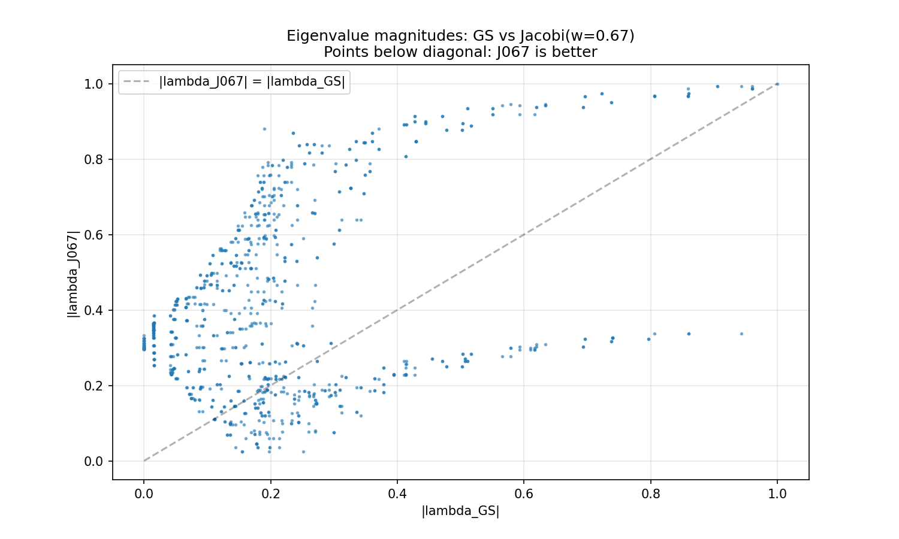
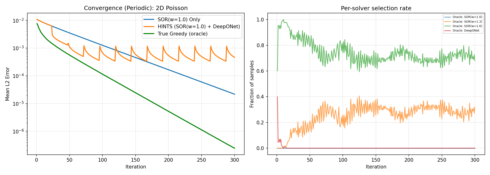
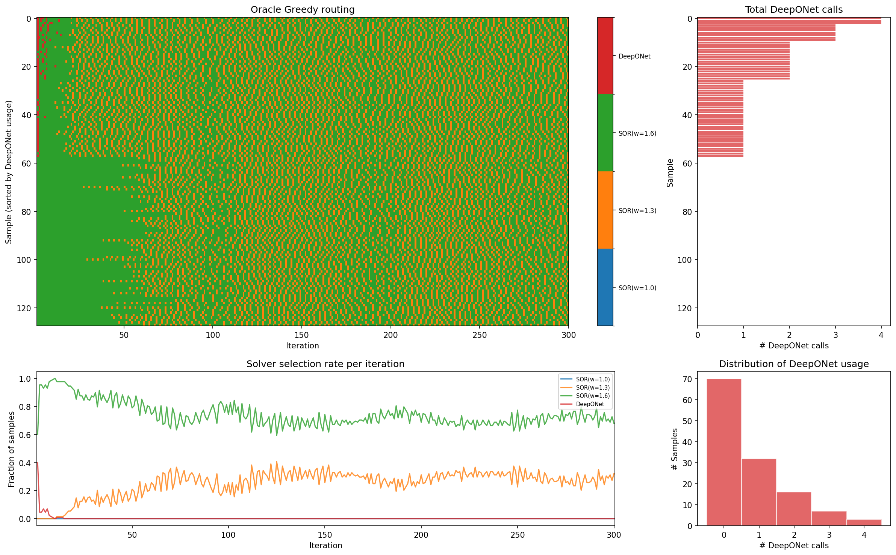
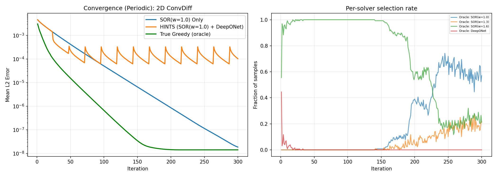
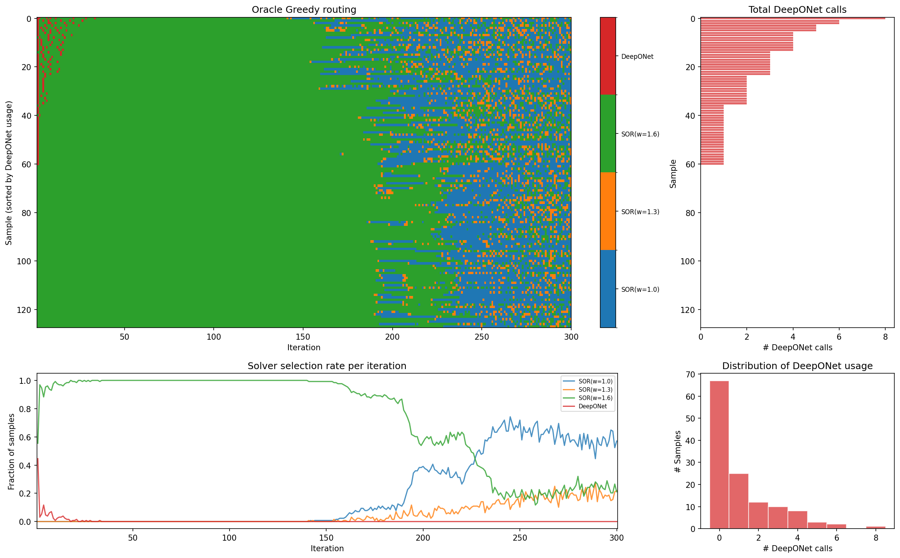

# Greedy Multi-Solver Routing for PDE Linear Systems

Adaptive solver selection for the subproblems of incompressible CFD

CFD Hackathon 2026

---

# Motivation: Verification Is the Bottleneck

### AI-Driven Engineering Design

AI workflows for engineering design are rapidly maturing — generative models can propose geometries, materials, and configurations at unprecedented speed.

But **every AI-generated design must be verified** through physics simulation before it can be trusted.

As generation gets faster, **verification (CFD/FEA simulation) becomes the dominant bottleneck** in the design loop.

### The ML Surrogate Dilemma

ML surrogates (neural operators, GNNs) can approximate PDE solutions **orders of magnitude faster** than classical solvers.

But they offer **no convergence guarantees** — predictions may look plausible while being quantitatively wrong.

**Our approach:** Hybrid solvers that route between classical methods (with guarantees) and ML surrogates (with speed). Get the best of both — use ML when it helps, fall back to classical when it doesn't, and **always converge**.

---
layout: two-cols
---

# Incompressible Navier–Stokes

The governing equations for incompressible flow:

$$
\frac{\partial \mathbf{u}}{\partial t} + (\mathbf{u} \cdot \nabla)\mathbf{u} = -\frac{1}{\rho}\nabla p + \nu \nabla^2 \mathbf{u} + \mathbf{f}
$$

$$
\nabla \cdot \mathbf{u} = 0
$$

**Key challenge:** velocity and pressure are coupled; pressure has no independent evolution equation.

::right::

### Splitting Methods

Projection / SIMPLE / PISO all split this into:

1. **Momentum predictor** — convection-diffusion solve for tentative velocity $\mathbf{u}^*$
2. **Pressure Poisson solve** — enforce $\nabla \cdot \mathbf{u} = 0$
3. **Velocity correction** — project onto divergence-free space

The pressure Poisson solve is often the **dominant computational bottleneck** (global elliptic problem).

---

# The Two Core Subproblems

### Momentum Predictor
**Convection-Diffusion Equation**

$$-\nu \nabla^2 u_i + \mathbf{u} \cdot \nabla u_i = \text{source}$$

- Advances velocity in time
- Linearized using lagged velocity
- One solve per velocity component

### Pressure Correction
**Poisson Equation**

$$\nabla^2 p^{n+1} = \frac{\rho}{\Delta t} \nabla \cdot \mathbf{u}^*$$

- Elliptic, globally coupled
- Enforces incompressibility
- Often the main bottleneck

**Both subproblems are solved iteratively — can we accelerate them with learned routing?**

---

# Iterative Solvers: The Landscape

Each linear subproblem $A\mathbf{u} = \mathbf{b}$ is solved by repeated iteration:

| Solver | Per-step cost | Convergence rate | Strengths |
|--------|--------------|-----------------|-----------|
| Jacobi($\omega$) | $O(N^2)$ | Slow | Parallelizable, tunable damping |
| Gauss-Seidel | $O(N^2)$ | ~2× Jacobi | Better for low-freq error |
| SOR($\omega$) | $O(N^2)$ | Tunable | Optimal $\omega$ can be much faster |
| Multigrid | $O(N^2)$ | $O(1)$ iters | Optimal, but complex |
| **ML Surrogate** | $O(N^2)$ | One-shot | Large initial correction |

**Key insight:** Different solvers damp different spectral modes of the error at different rates. No single solver is optimal at every stage of convergence.

---

# Greedy Multi-Solver Routing

### The Idea

At each iteration, **choose the solver** that gives the best immediate error reduction:

$$k^* = \arg\min_{k \in \{1,\ldots,K\}} \| u_k^{(t+1)} - u_{\text{true}} \|_2$$

**Solver portfolio:**
- SOR($\omega=1.0$) — Gauss-Seidel
- SOR($\omega=1.3$) — moderate over-relaxation
- SOR($\omega=1.6$) — aggressive over-relaxation
- DeepONet — ML correction

### Why It Works

Each SOR variant has a different spectral damping profile:

25% of modes have |λJacobi(0.67)| &lt; |λGS|: different solvers excel on different modes.

---
layout: section
---

# Results: 2D Poisson Equation

Oracle greedy with SOR portfolio — $K = 4$ solvers

---

# 2D Poisson: Convergence

**SOR(1.0) Only**
 Final L2: 2.17 × 10⁻⁵
 AUC: 0.485

**HINTS**
 Final L2: 4.61 × 10⁻⁴
 AUC: 0.377

**Greedy (Oracle)**
 Final L2: 2.45 × 10⁻⁷
 AUC: 0.115 (**4.2× better**)

---

# 2D Poisson: Routing Pattern

- **SOR(1.6)** dominates (~74%) — fastest for high-frequency error early on
- **SOR(1.3)** used ~25% throughout — better for certain mid-frequency modes
- **DeepONet** used sparingly (0.3%) — one-shot correction in first few iterations

---
layout: section
---

# Results: 2D Convection-Diffusion

Oracle greedy with SOR portfolio — the more interesting case

---

# 2D ConvDiff: Convergence

**SOR(1.0) Only**
 Final L2: 1.84 × 10⁻⁸
 AUC: 0.091

**HINTS**
 Final L2: 1.03 × 10⁻⁴
 AUC: 0.101

**Greedy (Oracle)**
 Final L2: 1.41 × 10⁻⁸
 AUC: 0.019 (**4.8× better**)

---

# 2D ConvDiff: Routing Pattern — Phase Transition

- Clear **phase transition** at iteration ~150–200
- Early: SOR(1.6) dominates (high-freq damping)
- Late: **SOR(1.0) rises to ~60%** as low-frequency modes dominate the residual
- The optimal relaxation parameter **shifts during convergence** — routing captures this

---

# Results Summary

| | **SOR(1.0) Only** | **HINTS** | **Oracle Greedy** | **Greedy / Best Baseline** |
|---|---|---|---|---|
| **2D Poisson — Final L2** | 2.17 × 10⁻⁵ | 4.61 × 10⁻⁴ | **2.45 × 10⁻⁷** | 88× lower |
| **2D Poisson — AUC** | 0.485 | 0.377 | **0.115** | 4.2× lower |
| **2D ConvDiff — Final L2** | 1.84 × 10⁻⁸ | 1.03 × 10⁻⁴ | **1.41 × 10⁻⁸** | 1.3× lower |
| **2D ConvDiff — AUC** | 0.091 | 0.101 | **0.019** | 4.8× lower |

**Key finding:** Multi-solver greedy routing achieves **4–5× lower AUC** than any single solver or fixed schedule (HINTS). The gains come from adapting the solver choice to the current error spectrum — not from any single solver being faster.

---

# K=2 Baseline: Learned Router Also Works

Prior results with Jacobi + DeepONet (K=2) and a **learned LSTM router**:

### 2D Poisson (K=2, Jacobi + DeepONet)
| Strategy | Final L2 | AUC |
|---|---|---|
| Jacobi Only | 4.37 × 10⁻⁴ | 0.919 |
| HINTS | 7.29 × 10⁻⁴ | 0.523 |
| Oracle Greedy | 4.41 × 10⁻⁵ | 0.192 |
| **LSTM Router** | **1.05 × 10⁻⁴** | **0.329** |

LSTM Router: **2.8× better AUC** than baseline

### 2D ConvDiff (K=2, Jacobi + DeepONet)
| Strategy | Final L2 | AUC |
|---|---|---|
| Jacobi Only | 1.55 × 10⁻⁴ | 0.337 |
| HINTS | 1.80 × 10⁻⁴ | 0.186 |
| Oracle Greedy | 1.29 × 10⁻⁵ | 0.077 |
| **LSTM Router** | **4.20 × 10⁻⁵** | **0.136** |

LSTM Router: **2.5× better AUC** than baseline

---

# Why Multi-Solver Routing?

### Spectral Intuition

Different solvers have different **eigenvalue amplification profiles**.

As convergence progresses:
1. High-freq error dies fast → all solvers good
2. Mid-freq error remains → SOR(1.6) excels
3. Low-freq error dominates → SOR(1.0) wins

The **optimal solver changes during convergence**.

### Connection to CFD

Each CFD time step requires:
- Multiple Poisson solves (pressure)
- Multiple ConvDiff solves (momentum)

A greedy router that adapts per-iteration could **reduce total iteration count** across the entire simulation.

The router is lightweight (LSTM, ~10K params) compared to the solvers themselves.

---

# Next Steps

### In Progress

- **Improved ML surrogates** — larger DeepONet and FNO (Fourier Neural Operator) training in progress
- **Learned router for K=4 SOR portfolio** — LSTM training to replace oracle
- **Spectral analysis** of routing decisions

### Future Directions

- **Multi-step lookahead** — RL-based planning instead of myopic greedy
- **Cyclic CFD integration** — stitch Poisson and ConvDiff routers in a projection-method loop
- **Variable coefficients** — per-sample optimal solvers for heterogeneous problems

The key contribution: **adaptive, learned solver selection** that exploits the complementary spectral properties of classical iterative methods and ML surrogates.

